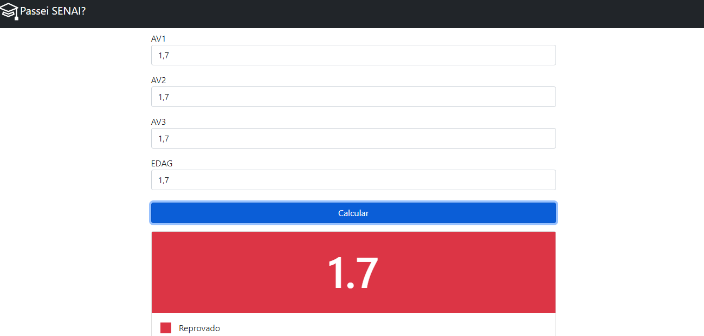
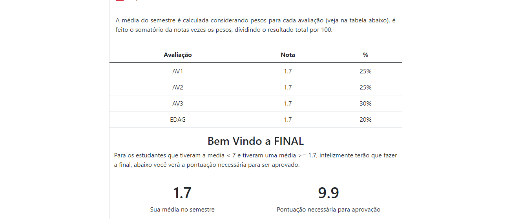
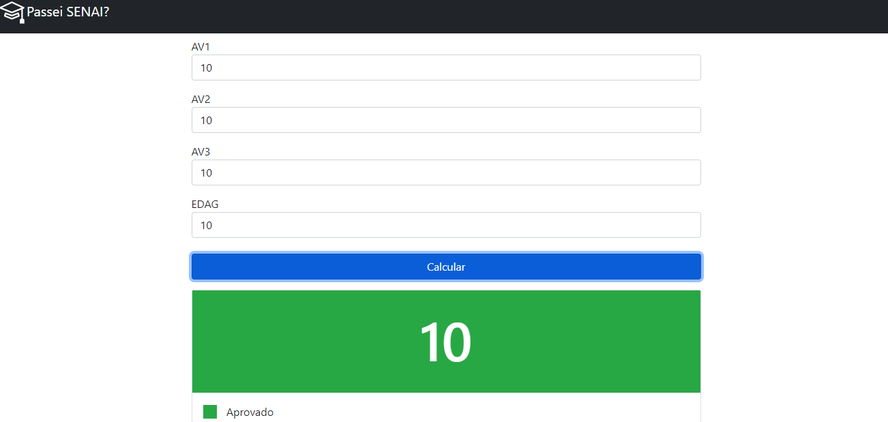

<h1 align="center">Passei SENAI</h1><!--Nome curto e objetivo-->
<h5 align="center">Status: Concluido </h5><!--Concluido, Em andamento ou Finalizado-->

<h2>Sumário</h2>
<!--Sumário que leva as sessões do readme-->
<ul>
    <li><a href="#sobre">Sobre</a></li>
    <li><a href="#requisitosmacro">Requisitos macro</a></li>
    <li><a href="#demo">Demonstração da aplicação</a></li>
    <li><a href="#prereq">Pré-requisitos e como rodar a aplicação</a></li>
    <li><a href="#tec">Tecnologias utilizadas</a></li>
    <li><a href="#autor">Responsáveis</a></li>
</ul>

<h2 id="sobre">💻 Sobre</h2>
<!--Descrição do contexto e produto do projeto - Consulte o documento F001-NDSI-Levantamento de Macro Requisitos-->

Uma aplicação de página única (SPA) que calcula a nota media do semestre de estudantes da graduação do SENAI CIMATEC e estipula a pontuação mínima necessária para aprovação caso o estudante for fazer a FINAL(avaliação caso o estudante não atinja a media do semestre). 

<h2 id="requisitosmacro">📝 Requisitos macro</h2>
<!--Lista de todos as funcionalidades do sistema (nível macro)-->
<ul>
    <li>Calcular média do semestre</li>
    <li>Calcular pontuação necessária para aprovação</li>
</ul>

<h2 id="demo">🎥 Demonstração da aplicação</h2>
<!--Conjunto de prints da aplicação-->
<h1 align="center">
    
    
    
</h1>

<h2 id="prereq">📀 Pré-requisitos e como rodar a aplicação</h2>
<!--Descrição do pré requisito de instalação na maquina em forma de passo a passo-->
<ol>
    <li>Instalar node 16.13.1</li>
    <li>Instalar npm 8.1.2</li>
    <li>Instalar angular CLI 13.0.3</li>
    <li>Com tudo instalado clone o repositório na sua máquina</li>
    <li>Abra a pasta do projeto no terminal e insirá <code>npm install</code>, instale a versão 8.1.2</li>
    <li>Para executar a aplicação em modo de DEV insirá <code>ng serve</code></li>
</ol>

<h2 id="tec">🔨Tecnologias utilizadas</h2>
<!--Descrição das tecnologias utilizadas (linguagem, biblioteca, framework etc)-->

As seguintes ferramentas foram utilizadas na construção do projeto:

<ul>
    <li>Angular CLI 13</li>
    <li>HTML 5</li>
    <li>CSS 3</li>
    <li>Typescript</li>
    <li>Angular Material</li>
</ul>

<h2 id="autor">👦 Responsáveis</h2>
<!--Listagem dos responsáveis pelo projeto-->
<ul>
   <li>Patrick Guilherme da Silva</li>
<ul>
